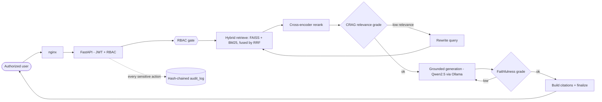

<div align="center">

# 🛡️ Aegis RAG

### Sovereign, air‑gapped Retrieval‑Augmented Generation for regulated industries

*Ask natural‑language questions over your private corpus and get **citation‑backed, faithfulness‑graded** answers — with **role‑based access enforced at retrieval** and a **tamper‑evident audit trail**. Nothing ever leaves the perimeter.*


</div>

---

## ✨ Why Aegis is different

Generic RAG apps phone home to OpenAI, leak across tenants, and can't prove what they did. Aegis is built for finance, government, and healthcare where that's unacceptable.

| | Capability |
|---|---|
| 🔒 | **100% on‑premise / air‑gapped.** LLM (Qwen2.5 32B via Ollama), embeddings (BGE‑M3), reranker (bge‑reranker‑v2‑m3) and the FAISS index all run locally. Weights are pre‑staged once; then the cluster runs **offline**. |
| 👥 | **RBAC at the *retrieval* layer.** Access is enforced where candidates are selected — a user can never see a forbidden document in an answer, a citation, a rerank candidate, or a log. |
| 🧭 | **Inspectable LangGraph pipeline.** Hybrid retrieval (FAISS + BM25 → RRF) → cross‑encoder rerank → **CRAG self‑correction** → grounded generation → **faithfulness grading** → citations. |
| 📌 | **Citations are mandatory.** Every factual claim maps to a chunk with `document_id`, `chunk_id`, and character offsets. No grounding ⇒ flagged, never faked. |
| 🚫 | **No silent hallucination.** If evidence is insufficient, Aegis says so. The corrective action is *internal query rewrite + re‑retrieval* — **never** a web search. |
| 🔗 | **Tamper‑evident audit log.** Hash‑chained, HMAC‑signed, append‑only (enforced by a DB trigger + a least‑privilege role), with a `/audit/verify` integrity endpoint. |
| ✅ | **CI‑gated evaluation.** RAGAS + a built‑in local evaluator (faithfulness / hallucination / relevancy) run against **local models only** and fail the build below thresholds. |

> 📜 Compliance‑mapped to **HIPAA · GDPR · EU AI Act · DORA · Swiss FADP/FINMA · UAE PDPL/DIFC Reg 10** — see [`docs/compliance-mapping.md`](./docs/compliance-mapping.md).

---

## 🧠 How a query flows



**System of record:** PostgreSQL (users/roles, docs/chunks, `query_log`, `audit_log`). **Live vector index:** FAISS. **LLM service:** Ollama. All on a private Docker network.

---

## 🚀 Quickstart

### 1 · Configure secrets

```bash
cp .env.example .env
# Generate real secrets (the app refuses to boot in production with CHANGE_ME_*):
python -c "import secrets; print('JWT_SECRET_KEY=' + secrets.token_hex(32))"
python -c "import secrets; print('AUDIT_HMAC_KEY=' + secrets.token_hex(32))"
# → set JWT_SECRET_KEY, AUDIT_HMAC_KEY, POSTGRES_PASSWORD, AUDIT_DB_PASSWORD in .env
```

### 2 · Provision models (the only online step)

```bash
make models     # BGE-M3 + bge-reranker-v2-m3 → ./models
make pull-llm   # qwen2.5:32b → the ollama volume
```

### 3 · Launch

```bash
make build
make up                 # full stack on a private bridge network
make migrate            # alembic upgrade head

# First admin (credentials from the environment, never hardcoded):
SEED_ADMIN_USERNAME=admin SEED_ADMIN_PASSWORD='change-this' \
  docker compose exec -e SEED_ADMIN_USERNAME -e SEED_ADMIN_PASSWORD \
  backend python scripts/seed_admin.py

make up-airgap          # 🔌 zero-egress mode: only the frontend is exposed
```

| Surface | URL |
|---|---|
| 🖥️ Frontend | `http://localhost:8080` |
| 📚 API docs (OpenAPI) | `http://localhost:8000/docs` |
| ❤️ Liveness | `GET /api/v1/health` |
| ✅ Readiness | `GET /api/v1/health/ready` |

---

## 🧩 Tech stack

| Layer | Choices |
|---|---|
| **Backend** | FastAPI · Pydantic v2 · SQLAlchemy 2 (async) + asyncpg · Alembic · LangGraph |
| **Retrieval** | FAISS (dense) · `rank_bm25` (lexical) · Reciprocal Rank Fusion · BGE‑M3 · bge‑reranker‑v2‑m3 |
| **Generation** | Qwen2.5 32B via Ollama (temperature 0 for all grading) |
| **Eval** | RAGAS + built‑in local evaluator — wired to **local** Ollama + embeddings |
| **Frontend** | React 18 · TypeScript (strict) · Vite · TanStack Query · Zustand · Tailwind |
| **Infra** | Docker Compose (+ `airgap` overlay) · nginx · GitHub Actions CI |

**Default roles:** `admin` · `compliance_auditor` · `analyst` · `viewer`  
**Classifications:** `public` · `internal` · `confidential` · `restricted`

---

## 🔌 API at a glance

```
POST /api/v1/auth/login            → access + refresh tokens
POST /api/v1/documents             → upload + ingest (analyst, admin)
POST /api/v1/query                 → cited, faithfulness-graded answer
POST /api/v1/query/stream          → SSE token stream + final QueryResponse
GET  /api/v1/audit/verify          → tamper-evidence attestation
POST /api/v1/eval/run              → RAGAS + local evaluator run (local models)
POST /api/v1/admin/users           → user + role management (audited)
```

---

## 🛠️ Development

```bash
cd backend
pip install -r requirements.txt && pip install -e ".[dev]"
ruff check . && ruff format --check . && mypy app && pytest   # the full gate

cd ../frontend
npm install && npm run typecheck && npm run build
```

CI (`.github/workflows/ci.yml`) runs lint → strict type‑check → migrations → tests → the local‑model eval gate on every push.

---

## 🔐 Security & compliance

- **Secrets** live only in `.env` (git‑ignored); production refuses to boot on placeholder values.
- **Tokens** are kept in memory on the client; refresh rotates on use.
- **Audit log** is append‑only & hash‑chained — mutation is blocked by a DB trigger *and* a least‑privilege `aegis_audit` role (`INSERT, SELECT` only); `verify_chain` recomputes every link and reports the first break.
- **Zero egress** is proven by the `docker-compose.airgap.yml` overlay: internal‑only network, empty DNS, dropped capabilities, and no published ports except the frontend.

Deeper docs: [architecture](./docs/architecture.md) · [compliance mapping](./docs/compliance-mapping.md) · [threat model](./docs/threat-model.md) · [air‑gap runbook](./docs/runbook-airgap-provisioning.md).

---

## 🗂️ Repository layout

```
aegis-rag/
├── backend/    FastAPI app · LangGraph pipeline · retrieval · audit · eval · tests
├── frontend/   React + TypeScript (Vite) UI
├── infra/      nginx · postgres init · provisioning scripts
├── eval/       CI eval gate + golden datasets
└── docs/       architecture · compliance · threat model · runbook
```

> 📖 [`CLAUDE.md`](./CLAUDE.md) is the single source of truth — golden rules, full module contracts, DB schema, API surface, and the per‑module definition of done.

<div align="center">
<sub>Built to be air‑gapped, auditable, and deterministic — in that order.</sub>
</div>
