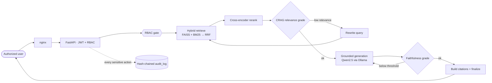
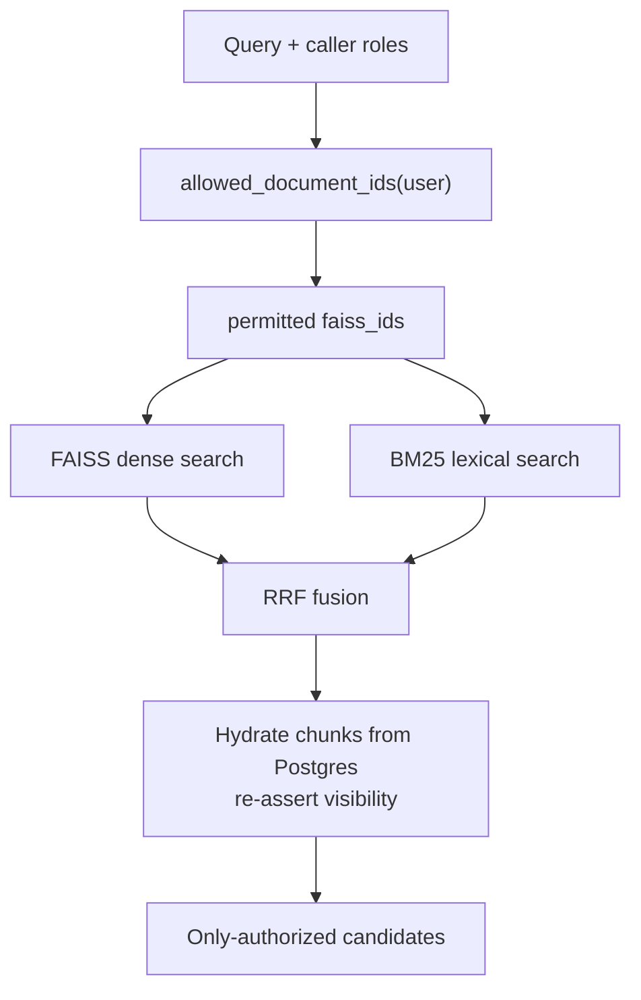
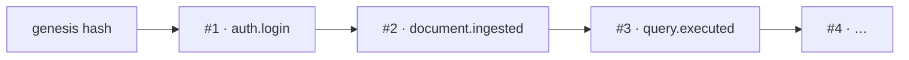

<div align="center">

# 🛡️ Aegis RAG

### Sovereign, air-gapped Retrieval-Augmented Generation for regulated industries

*Ask natural-language questions over your private corpus and get **citation-backed, faithfulness-graded** answers — with **role-based access enforced at retrieval** and a **tamper-evident audit trail**. Nothing ever leaves the perimeter.*

<br/>


</div>

---

## Contents

- [The problem Aegis solves](#the-problem-aegis-solves)
- [What makes it different](#what-makes-it-different)
- [How a query flows](#how-a-query-flows)
- [The trust contract](#the-trust-contract)
- [Access control, enforced at retrieval](#access-control-enforced-at-retrieval)
- [The tamper-evident audit ledger](#the-tamper-evident-audit-ledger)
- [The interface](#the-interface)
- [Quickstart](#quickstart)
- [Configuration](#configuration)
- [Tech stack](#tech-stack)
- [API reference](#api-reference)
- [Evaluation](#evaluation)
- [Development & testing](#development--testing)
- [Security & compliance](#security--compliance)
- [Repository layout](#repository-layout)

---

## The problem Aegis solves

Most RAG stacks are built for convenience, not custody. They call a hosted model, index every document in one flat namespace, and keep no defensible record of what was asked or answered. In **finance, government, and healthcare**, all three are disqualifying: data cannot leave the perimeter, one analyst must never retrieve another team's restricted files, and every access has to be provable years later.

**Aegis RAG** is built the other way around. Inference, embeddings, reranking, and the vector index all run **on your own hardware**. Access is enforced *where documents are selected*, not bolted on at the API. Every answer carries its evidence, and every sensitive action is written to a cryptographic chain you can independently verify.

> 📜 Compliance-mapped to **HIPAA · GDPR · EU AI Act · DORA · Swiss FADP / FINMA · UAE PDPL / DIFC Reg 10** — see [`docs/compliance-mapping.md`](./docs/compliance-mapping.md).

---

## What makes it different

| | Capability | Why it matters |
|---|---|---|
| 🔒 | **100% on-premise / air-gapped** — Qwen2.5 32B (Ollama), BGE-M3 embeddings, bge-reranker-v2-m3, and FAISS all run locally. Weights are pre-staged once; then the cluster runs offline. | No third party ever sees a query or a document. Data residency is a property of the deployment, not a promise. |
| 👥 | **RBAC at the *retrieval* layer** — the caller's roles filter the candidate set *before* ranking. | A user can't receive a forbidden document in an answer, a citation, a rerank candidate, or a log — even by accident. |
| 🧭 | **Inspectable LangGraph pipeline** — hybrid retrieval → rerank → CRAG self-correction → generation → faithfulness grading → citations. | The reasoning path is an explicit state machine you can read, test, and audit — not a black box. |
| 📌 | **Citations are mandatory** — every claim maps to a chunk with `document_id`, `chunk_id`, and character offsets. | Answers are traceable to the source span. No grounding ⇒ the answer is flagged, never faked. |
| 🚫 | **No silent hallucination** — if evidence is insufficient, Aegis says so. Correction is *internal query rewrite + re-retrieval*, **never** a web search. | Refusal is a first-class outcome. The air gap is never broken to "find an answer." |
| 🔗 | **Tamper-evident audit log** — hash-chained, HMAC-signed, append-only (enforced by a DB trigger *and* a least-privilege role), with a `/audit/verify` endpoint. | You can prove the record wasn't altered, and pinpoint the exact entry if it was. |
| ✅ | **CI-gated evaluation** — RAGAS + a built-in local evaluator score faithfulness / hallucination / relevancy against local models and fail the build below thresholds. | Quality is a gate, not a vibe — and the eval itself never phones home. |

---

## How a query flows



Each stage does one job, and hands a typed state object to the next:

1. **Retrieve** — dense vectors (FAISS) and lexical matches (`rank_bm25`) are searched in parallel, both already filtered to the caller's permitted documents, then fused with **Reciprocal Rank Fusion** (rank-based, so incomparable score scales don't matter).
2. **Rerank** — a cross-encoder rescoring pass keeps the top few most relevant chunks for generation.
3. **Grade documents (CRAG)** — each candidate is graded for relevance; if too few are relevant, the query is rewritten and retrieval runs again (bounded — no infinite loops, no web search).
4. **Generate** — the model answers **only** from the numbered contexts and cites them inline as `[n]`.
5. **Grade faithfulness** — the answer is checked against its sources; below threshold it regenerates once, then finalizes honestly rather than confidently.
6. **Finalize** — inline markers become structured citations with offsets; the response, `query_log` row, and audit record are written.

> **System of record:** PostgreSQL (users/roles, docs/chunks, `query_log`, `audit_log`). **Live vector index:** FAISS. **LLM service:** Ollama. All on a private Docker network.

---

## The trust contract

Aegis never returns a bare paragraph you have to trust on faith. Every answer arrives with its evidence and one of three honest states:

| State | Meaning | What you see |
|---|---|---|
| ✅ **Verified · grounded** | Faithfulness score ≥ threshold and every claim is cited. | The answer, citation chips (click for the source snippet + page + offsets), and the retrieved spans. |
| ⚠️ **Unverified · low faithfulness** | The model answered, but the answer isn't sufficiently supported by the sources. | The answer, clearly flagged — *not* presented as trustworthy. |
| 🚫 **Insufficient evidence** | Retrieval + correction couldn't ground an answer. | An explicit refusal. No fabrication, no outside knowledge. |

Faithfulness is a real number (`0.00–1.00`) gated at `FAITHFULNESS_THRESHOLD` (default `0.70`), surfaced to the user — not hidden.

---

## Access control, enforced at retrieval

The defining architectural choice: **authorization gates the candidate set, not just the endpoint.** A document carries a `classification` and an `allowed_roles` set; the caller's roles are resolved to a set of permitted `faiss_id`s that is passed into *both* the vector and lexical search **before** anything is ranked — then re-asserted when chunks are hydrated from Postgres (defense in depth). Any error computing visibility **fails closed** (empty set → "insufficient evidence").



**Visibility rule:** a document is visible to a user **iff** the user has at least one role in `allowed_roles` **or** the user is `admin`.

| Role | Sees |
|---|---|
| `admin` | Everything. |
| `compliance_auditor` | Audit trail + metadata; document *content* follows the same visibility rule unless explicitly granted. |
| `analyst` | Documents whose `allowed_roles` include a role they hold. Can upload/ingest. |
| `viewer` | Read-only, within their permitted classifications. |

**Classifications** (default ramp of exposure): `public` · `internal` · `confidential` · `restricted`.

---

## The tamper-evident audit ledger

Every sensitive action — login, query, ingest, delete, role change, config change — is appended to a hash chain. Each entry links to the previous one:

```
entry_hash = HMAC-SHA256( canonical(payload) + prev_hash )
```



- **Append-only, twice over** — a `BEFORE UPDATE/DELETE` trigger raises, *and* the app writes through a least-privilege `aegis_audit` role granted only `INSERT, SELECT`.
- **Fail-closed** — if the audit write fails, the triggering operation fails with it. There is no un-audited path.
- **Independently verifiable** — `GET /api/v1/audit/verify` recomputes every link and reports `{ ok, total, first_broken_id, broken_field }`, so a single altered byte is located precisely.

---

## The interface

A dark **"Sovereign Instrument"** console — designed to read as instrumentation for an operator, not a generic dashboard. Monospace carries the data (hashes, IDs, scores); color is *earned*, appearing only where it encodes classification or trust.

| Screen | What it does |
|---|---|
| **Terminal (login)** | Operator sign-in; a live "air-gapped · zero egress" status readout. |
| **Interrogate (chat)** | Ask the corpus; answers stream in with a **trust seal**, citation chips, and an **evidence rail** showing the faithfulness gauge, CRAG document grades, and retrieved spans. |
| **Corpus (documents)** | RBAC-filtered document list; upload with a classification + allowed-roles selector. |
| **Ledger (audit)** | The hash chain as a visual spine — linked entries with truncated hashes and a one-click **Verify chain**. |
| **Evaluation** | Trigger RAGAS + local-evaluator runs and read faithfulness / hallucination metric cards. |

Built to a quality floor: strict TypeScript, keyboard-focus visible, reduced-motion respected, responsive to mobile.

---

## Quickstart

> **Prerequisites:** Docker + Docker Compose. Qwen2.5 32B (~20 GB at Q4) wants a **24 GB+ GPU** or a large-RAM CPU box. Only steps 1–2 touch the network; everything after runs offline.

### 1 · Configure secrets

```bash
cp .env.example .env
# Generate real secrets (the app refuses to boot in production with CHANGE_ME_*):
python -c "import secrets; print('JWT_SECRET_KEY=' + secrets.token_hex(32))"
python -c "import secrets; print('AUDIT_HMAC_KEY=' + secrets.token_hex(32))"
# → set JWT_SECRET_KEY, AUDIT_HMAC_KEY, POSTGRES_PASSWORD, AUDIT_DB_PASSWORD in .env
```

### 2 · Provision models — *the only online step*

```bash
make models     # BGE-M3 + bge-reranker-v2-m3 → ./models
make pull-llm   # qwen2.5:32b → the ollama volume
```

### 3 · Launch

```bash
make build
make up                 # full stack on a private bridge network
make migrate            # alembic upgrade head

# First admin (credentials from the environment, never hardcoded):
SEED_ADMIN_USERNAME=admin SEED_ADMIN_PASSWORD='change-this' \
  docker compose exec -e SEED_ADMIN_USERNAME -e SEED_ADMIN_PASSWORD \
  backend python scripts/seed_admin.py

make up-airgap          # 🔌 zero-egress mode: only the frontend is exposed
```

### 4 · Open

| Surface | URL |
|---|---|
| 🖥️ Frontend | `http://localhost:8080` |
| 📚 API docs (OpenAPI) | `http://localhost:8000/docs` |
| ❤️ Liveness | `GET /api/v1/health` |
| ✅ Readiness | `GET /api/v1/health/ready` — `503` until models finish loading |

<details>
<summary><b>End-to-end smoke test</b> (after provisioning)</summary>

1. Seed an admin, sign in at `:8080`.
2. Ingest a document with a classification (e.g. `confidential`, allowed roles `analyst`).
3. Sign in as a lesser role and ask a question about it.
4. Confirm you get either a cited, faithful answer **or** an explicit insufficient-evidence response.
5. Open **Ledger → Verify chain** and confirm the trail is intact.

That path — restricted ingest → role-scoped query → verifiable audit — is the whole product in one loop.
</details>

---

## Configuration

Everything is read through a single settings ingress (`backend/app/core/config.py`); nothing reads `os.environ` directly. In `production`, the app **refuses to boot** on missing or placeholder (`CHANGE_ME_*`) secrets, and builds `DATABASE_URL` from parts. Full list with defaults in [`.env.example`](./.env.example).

<details>
<summary><b>Key settings by group</b></summary>

| Group | Keys (selected) | Notes |
|---|---|---|
| **App** | `APP_ENV`, `LOG_FORMAT`, `CORS_ORIGINS`, `RATE_LIMIT_PER_MINUTE` | `production` enforces secret validation. |
| **Secrets** | `JWT_SECRET_KEY`, `AUDIT_HMAC_KEY`, `POSTGRES_PASSWORD`, `AUDIT_DB_PASSWORD` | Must be real (not `CHANGE_ME_*`) in production. |
| **LLM** | `OLLAMA_MODEL`, `OLLAMA_NUM_CTX`, `OLLAMA_TEMPERATURE_GEN`, `OLLAMA_TEMPERATURE_GRADE` | Grading/faithfulness run at `temperature=0.0`. |
| **Embeddings / rerank** | `EMBEDDING_MODEL_PATH`, `EMBEDDING_DIM=1024`, `RERANKER_MODEL_PATH` | Weights pre-staged under `./models`. |
| **Retrieval / CRAG** | `RETRIEVAL_TOP_K=40`, `RRF_K=60`, `RERANK_TOP_N=8`, `CRAG_RELEVANCE_THRESHOLD=0.5`, `FAITHFULNESS_THRESHOLD=0.7`, `MAX_CORRECTION_ATTEMPTS=1`, `MAX_REGEN_ATTEMPTS=1` | The correction/regeneration loops are always bounded. |
| **Offline enforcement** | `HF_HUB_OFFLINE=1`, `TRANSFORMERS_OFFLINE=1`, `HF_DATASETS_OFFLINE=1` | Do not change — these keep model libs from reaching the Hub. |

</details>

---

## Tech stack

| Layer | Choices |
|---|---|
| **Backend** | FastAPI · Pydantic v2 · SQLAlchemy 2 (async) + asyncpg · Alembic · LangGraph |
| **Retrieval** | FAISS (dense) · `rank_bm25` (lexical) · Reciprocal Rank Fusion · BGE-M3 · bge-reranker-v2-m3 |
| **Generation** | Qwen2.5 32B via Ollama (temperature 0 for all grading) |
| **Eval** | RAGAS + built-in local evaluator — wired to **local** Ollama + embeddings |
| **Frontend** | React 18 · TypeScript (strict) · Vite · TanStack Query · Zustand · Tailwind |
| **Infra** | Docker Compose (+ `airgap` overlay) · nginx · GitHub Actions CI |

---

## API reference

Base path `/api/v1`. All non-auth routes require a bearer token; errors use a uniform envelope `{ "error": { "code", "message", "request_id" } }`; every sensitive call is audited.

```
POST /api/v1/auth/login            → access + refresh tokens
POST /api/v1/documents             → upload + ingest        (analyst, admin)
POST /api/v1/query                 → cited, faithfulness-graded answer
POST /api/v1/query/stream          → SSE token stream + final QueryResponse
GET  /api/v1/audit/verify          → tamper-evidence attestation   (auditor, admin)
POST /api/v1/eval/run              → RAGAS + local evaluator run    (admin)
POST /api/v1/admin/users           → user + role management (audited, admin)
```

<details>
<summary><b>Full endpoint list</b></summary>

**Auth** — `POST /auth/login` · `POST /auth/refresh` · `POST /auth/logout` · `GET /auth/me`
**Documents** — `POST /documents` · `GET /documents` · `GET /documents/{id}` · `DELETE /documents/{id}` · `POST /documents/{id}/reindex`
**Query** — `POST /query` · `POST /query/stream`
**Audit** — `GET /audit` · `GET /audit/verify` · `GET /audit/export`
**Eval** — `POST /eval/run` · `GET /eval/runs` · `GET /eval/runs/{id}`
**Admin** — `POST /admin/users` · `GET /admin/users` · `POST /admin/users/{id}/roles` · `POST /admin/roles`
**Health** — `GET /health` · `GET /health/ready`

A `QueryResponse` carries `answer`, `faithful`, `faithfulness_score`, `insufficient_evidence`, `citations[]`, `retrieved_chunks[]`, `doc_grades[]`, `correction_applied`, and `latency_ms`.
</details>

---

## Evaluation

Answer quality is gated in CI, using **local models only** — the evaluator never falls back to a hosted API.

- **RAGAS** — faithfulness, answer relevancy, context precision/recall, wired to local Ollama + BGE-M3 embeddings.
- **Built-in local evaluator** — faithfulness / hallucination / answer-relevancy driven by the local model. (The third-party `deepeval` package is intentionally **not** a dependency — it ships telemetry and eager cloud-model imports that would break the air gap.)

```bash
python eval/ci_gate.py --suite both      # exits non-zero below thresholds
```

The gate skips cleanly (exit 0) when no local model is provisioned; add `--require` to make it blocking.

---

## Development & testing

```bash
# Backend — the full local gate (mirrors CI)
cd backend
pip install -r requirements.txt && pip install -e ".[dev]"
ruff check . && ruff format --check . && mypy app && pytest

# Frontend — strict typecheck + build
cd ../frontend
npm install && npm run typecheck && npm run build
```

| Suite | How to run | Notes |
|---|---|---|
| **Unit** | `pytest tests/unit` | Runs anywhere; model-dependent tests self-skip when weights are absent. |
| **Integration** | `TEST_DATABASE_URL=postgresql+asyncpg://… pytest tests/integration` | Skips unless a reachable asyncpg DSN is set (use a throwaway DB — tables are dropped/recreated). |
| **Eval gate** | `python eval/ci_gate.py --suite both` | Local models only. |

CI (`.github/workflows/ci.yml`) runs lint → strict type-check → migrations → tests → the local-model eval gate on every push.

---

## Security & compliance

- **Secrets** live only in `.env` (git-ignored); production refuses to boot on placeholder values.
- **Tokens** stay in memory on the client; refresh rotates on use.
- **Audit log** is append-only & hash-chained — mutation is blocked by a DB trigger *and* the least-privilege `aegis_audit` role; `verify_chain` recomputes every link and reports the first break.
- **Fail closed** — any auth / RBAC / audit error denies and logs; it never default-allows.
- **Zero egress** is proven by `docker-compose.airgap.yml`: internal-only network, empty DNS, dropped capabilities, and no published ports except the frontend.

📚 Deeper docs: [architecture](./docs/architecture.md) · [compliance mapping](./docs/compliance-mapping.md) · [threat model](./docs/threat-model.md) · [air-gap runbook](./docs/runbook-airgap-provisioning.md).

---

## Repository layout

```
aegis-rag/
├── backend/    FastAPI app · LangGraph pipeline · retrieval · audit · eval · tests
├── frontend/   React + TypeScript (Vite) — the Sovereign Instrument UI
├── infra/      nginx · postgres init (roles, triggers) · provisioning scripts
├── eval/       CI eval gate + golden datasets
├── docs/       architecture · compliance · threat model · runbook
└── models/     pre-staged BGE-M3 + bge-reranker-v2-m3 weights
```

> 📖 [`CLAUDE.md`](./CLAUDE.md) is the single source of truth — golden rules, module contracts, DB schema, the full API surface, and the per-module definition of done.

<div align="center">
<br/>
<sub>Built to be air-gapped, auditable, and deterministic — in that order.</sub>
</div>
